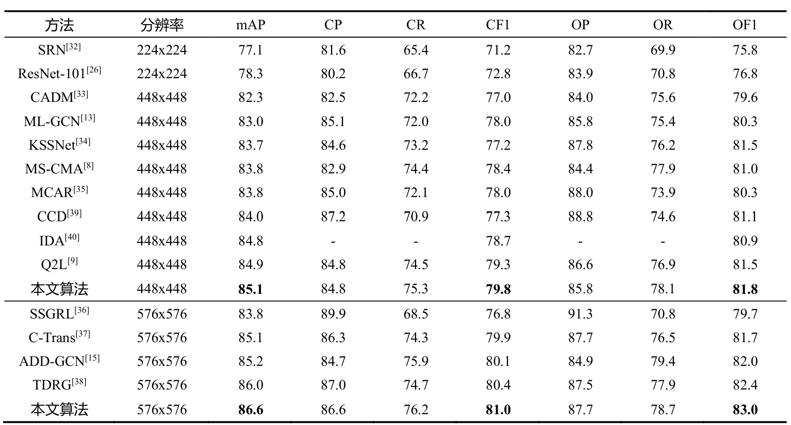

# TBALN
论文"基于多尺度特征融合和Transformer的多标签图像分类"的官方PyTorch实现

## 实验结果

## 实验环境
Python = 3.8
Pytorch = 1.10.1
Numpy = 1.23.1 
tqdm = 4.63.0
yaml = 0.2.5
tkinter = 8.6.11

## 模型权重下载
我们提供了COCO2014数据集下的模型权重文件，以及相关的日志文件：https://drive.google.com/drive/folders/15M2KiguWuvmptFVEaAa7HVgL1_h4CYQP?usp=drive_link

